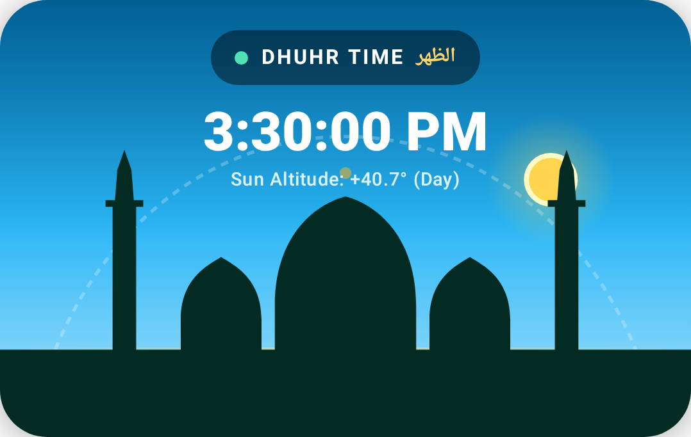
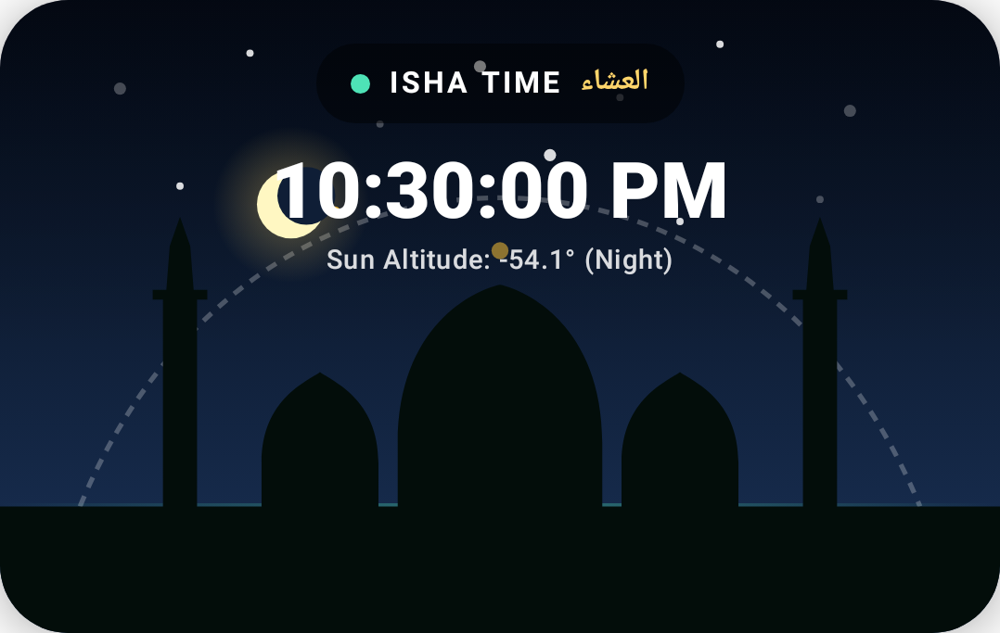

# Qayam (قيام)

[](https://developer.android.com/)
[](https://kotlinlang.org/)
[](https://developer.android.com/jetpack/compose)
[](https://dagger.dev/hilt/)
[](https://developer.android.com/)
[](https://developer.android.com/)
[](#-astronomical-calculation-engine)

**Qayam** is an offline-first Android application designed for accurate Islamic prayer calculations, celestial horizon visualization, and dependable Adhan notifications.

Built with **Modern Android Development (MAD)** practices, Jetpack Compose, Material 3, and Dagger Hilt, Qayam computes all prayer schedules locally using high-precision astronomical algorithms with zero network reliance.

---

## Visual Showcase

| Daytime Horizon & Countdown | Night Sky & Crescent Moon | Midnight Mosque Theme |
|:---:|:---:|:---:|
|  |  |  |

---

## ✨ Key Features

### ☀️ Animated Sun & Moon Horizon Canvas
* **Real-time Celestial Tracking:** Parabolic trajectory canvas mapping the live mathematical altitude of the Sun during the day and the Crescent Moon at night.
* **Dynamic Sky Gradients:** Dynamic color palettes transitioning across 8 diurnal phases: Fajr dawn glow, Sunrise, Israq, Dhuhr azure, Asr golden hour, Sunset crimson, Maghrib dusk, and Isha midnight blue.
* **Mosque Architecture Silhouettes:** Procedurally drawn mosque silhouette featuring minarets, central dome, side domes, and crescent finials illuminated by dynamic horizon accents.
* **Celestial Animations:** Smooth pulsing solar flares and twinkling starfields active during twilight and nighttime.

### 📴 100% Offline Astronomical Solar Math
* **Zero API Dependence:** Prayer times are calculated locally using astronomical solar algorithms based on the Julian Day number, solar declination, and equation of time.
* **8 Global Calculation Authorities:**
  1. **Muslim World League (MWL)** — Fajr: 18°, Isha: 17°
  2. **Islamic Society of North America (ISNA)** — Fajr: 15°, Isha: 15°
  3. **Egyptian General Authority of Survey** — Fajr: 19.5°, Isha: 17.5°
  4. **Umm al-Qura University, Makkah** — Fajr: 18.5°, Isha: 90 min after Maghrib
  5. **University of Islamic Sciences, Karachi** — Fajr: 18°, Isha: 18°
  6. **Gulf / Dubai (UAE)** — Fajr: 18.2°, Isha: 18.2°
  7. **Institute of Geophysics, University of Tehran** — Fajr: 17.7°, Maghrib: 4.5°, Isha: 14°
  8. **Union des Organisations Islamiques de France (UOIF)** — Fajr: 12°, Isha: 12°
* **Juristic Schools (Asr):**
  * **Standard (Shafi'i, Maliki, Hanbali):** Shadow length factor $1\times$.
  * **Hanafi:** Shadow length factor $2\times$.
* **High-Latitude Adjustments:** Angle-Based, Middle of the Night, and One-Seventh of the Night apportionments.
* **Minute Fine-Tuning:** Individual $(+/-)$ offsets for every prayer to synchronize with local mosque timetables.

### 🕌 Full Daily Schedule & Live Countdown
* Tracks all 8 daily milestones:
  * **Fajr** (الفجر)
  * **Sunrise** (شُرُوق الشَّمْس)
  * **Israq / Duha** (الإشراق)
  * **Dhuhr** (الظهر)
  * **Asr** (العصر)
  * **Sunset** (غُروب الشَّمْس)
  * **Maghrib** (المغرب)
  * **Isha** (العشاء)
* Live countdown timer showing remaining hours, minutes, and seconds to the upcoming prayer.
* Progress bar showing percentage elapsed within the current prayer window.
* Toggle between 12-hour (AM/PM) and 24-hour formats.

### 🔊 High-Fidelity Adhans & Reliable Alarms
* **Authentic Adhan Audio Recordings:**
  * **Makkah Al-Mukarramah** (Al-Masjid Al-Haram)
  * **Madinah Al-Munawwarah** (Al-Masjid An-Nabawi)
  * **Al-Aqsa Al-Quds**
  * System Ringtone / Alarm audio
  * Vibrate-only and Silent notification options
* **Background Reliability:**
  * **Android 12+ Exact Alarms:** Uses `AlarmManager.setAlarmClock` with `SCHEDULE_EXACT_ALARM` support and fallback to `setAndAllowWhileIdle`.
  * **Foreground Service (`AdhanPlaybackService`):** Plays audio with `mediaPlayback` type, notification actions, and a partial `WakeLock` to prevent OEM power managers from killing audio mid-call.
  * **Broadcast Resilience (`BootReceiver`):** Automatically reschedules all alarms upon `BOOT_COMPLETED`, `MY_PACKAGE_REPLACED`, `TIME_SET`, `TIMEZONE_CHANGED`, or alarm permission state changes.
  * **Interactive Diagnostics:** Dedicated "Background Reliability" dashboard with direct links to OEM battery optimization menus and a **10-Second Test Alarm** button.

### 📍 Smart Location Management
* **GPS Auto-Detection:** Uses Google Play Services `FusedLocationProviderClient` with low-battery overhead.
* **Offline Reverse Geocoding:** Converts coordinates to city and country names using Android's native `Geocoder`.
* **17 Offline City Presets:** Instant selection without GPS for Makkah, Madinah, Jerusalem (Al-Quds), Dubai, Cairo, Istanbul, Karachi, New Delhi, Dhaka, Kuala Lumpur, Jakarta, London, New York, Toronto, Paris, Singapore, and Sydney.

### 🎨 Themes & Customization
* **System Default:** Automatically tracks light and dark system settings.
* **Light Desert Dawn:** Warm desert sands with emerald accents.
* **Dark Sapphire:** Midnight deep tones for eye comfort.
* **Midnight Mosque:** Islamic emerald, rich jade, and warm gold highlights.

---

## 🏛️ Architecture & Tech Stack

Qayam follows **Clean Architecture** and **Unidirectional Data Flow (UDF)** patterns:

```
                  ┌─────────────────────────────────────┐
                  │          Jetpack Compose UI         │
                  │   (MainPrayerScreen, SettingsScreen)│
                  └──────────────────▲──────────────────┘
                                     │ StateFlow / Actions
                  ┌──────────────────┴──────────────────┐
                  │           PrayerViewModel           │
                  │    (UI State, TickerManager, DI)    │
                  └──────────▲────────────────▲─────────┘
                             │                │
            ┌────────────────┴──────┐  ┌──────┴────────────────┐
            │      Domain Layer     │  │   TickerManager (1Hz) │
            │      (Use Cases)      │  │ (Isolated recomposition)
            └──────────▲────────────┘  └───────────────────────┘
                       │
   ┌───────────────────┼───────────────────┬───────────────────┐
   │                   │                   │                   │
┌──┴─────────────┐ ┌───┴─────────────┐ ┌───┴─────────────┐ ┌───┴─────────────┐
│  Prayer Solar  │ │   Preferences   │ │  Location &     │ │  Audio & Alarm  │
│   Calculator   │ │    DataStore    │ │  City Presets   │ │    Service      │
│  (Astronomical)│ │(SettingsRepo)   │ │ (FusedLocation) │ │ (ExactAlarm)    │
└────────────────┘ └─────────────────┘ └─────────────────┘ └─────────────────┘
```

### Module Structure

```
app/src/main/java/tech/sadique/qayam/
├── audio/            # AudioPlayer, Adhan playback engines & focus management
├── data/
│   ├── calculator/   # Solar astronomical algorithms & prayer window math
│   ├── location/     # FusedLocationProvider, Geocoder & 17 City Presets
│   ├── model/        # Domain entities (PrayerType, AdhanSoundType, Schedule)
│   └── preferences/  # Jetpack DataStore implementation & settings mapper
├── di/               # Dagger Hilt dependency injection modules
├── domain/           # Use cases (RecalculateSchedule, RefreshLocation, etc.)
├── notification/     # AlarmScheduler, ExactAlarmGateway, Notification Channels
├── receiver/         # AdhanAlarmReceiver & BootReceiver (reboot/time resilience)
├── service/          # AdhanPlaybackService (Foreground audio player with WakeLock)
└── ui/
    ├── components/   # MasjidHorizonCanvas, PrayerCard, CountdownTimerView
    ├── navigation/   # Compose Navigation Host & Screen destinations
    ├── screens/      # MainPrayerScreen & SettingsScreen (with sub-sections)
    ├── theme/        # Color palettes, typography & Material 3 theme setups
    └── viewmodel/    # PrayerViewModel, TickerManager & SettingsUpdateFacade
```

### Key Libraries & Tools

| Component | Technology | Version | Purpose |
|---|---|---|---|
| **Language** | Kotlin | `2.4.10` | Modern language with Coroutines & Flow |
| **UI Toolkit** | Jetpack Compose | BOM `2026.08.00` | Declarative UI |
| **Design System**| Material 3 | BOM | Modern Android UI components |
| **Architecture** | AndroidX Lifecycle | `2.11.0` | ViewModel, `collectAsStateWithLifecycle` |
| **DI** | Dagger Hilt | `2.60.1` | Compile-time dependency injection |
| **Storage** | Jetpack DataStore | `1.2.1` | Reactive, asynchronous key-value persistence |
| **Location** | Google Play Services | `21.4.0` | Fused Location Provider |
| **Testing** | JUnit 4 + Robolectric | `4.13.2` / `4.16.1` | JVM unit & Android framework tests |
| **Snapshots** | Roborazzi | `1.73.0` | Automated screenshot test verification |
| **Linter** | Detekt | `2.0.0-alpha.6` | Static code analysis & ktlint formatting |

---

## ⚡ Performance: Zero-Lag 1 Hz Ticker Architecture

To eliminate unnecessary composable recompositions:
1. **Separated State Streams:** High-frequency clock ticks (`currentTimeMillis`, `sunAltitude`, `progressInWindow`) are isolated inside `PrayerTickerState` via `TickerManager`.
2. **Targeted Recomposition:** Only the countdown timer, live digital clock, and `MasjidHorizonCanvas` subscribe to `tickerState`. The prayer cards, navigation bars, and settings screens observe the stable `PrayerUiState` and remain completely static until schedule or preference changes occur.

---

## 🚀 Getting Started

### Prerequisites
* **Android Studio:** Ladybug (2024.2.1) or newer
* **JDK:** Version 17 (or Version 21)
* **Android SDK:**
  * Minimum SDK: `24` (Android 7.0)
  * Compile SDK: `37`
  * Target SDK: `36`

### Building the Project

1. **Clone the repository:**
   ```bash
   git clone git@github.com:mdsadiqueinam/Qayam.git
   cd Qayam
   ```

2. **Open with Android Studio** or build from the command line:
   ```bash
   ./gradlew assembleDebug
   ```

3. **Install on a connected device or emulator:**
   ```bash
   ./gradlew installDebug
   ```

### Running Tests & Verification

* **Execute Unit & Robolectric Tests:**
  ```bash
  ./gradlew testDebugUnitTest
  ```

* **Execute Roborazzi Screenshot Tests:**
  ```bash
  ./gradlew recordRoborazziDebug
  ```

* **Run Detekt Static Code Analysis:**
  ```bash
  ./gradlew detekt
  ```

---

## ⚙️ Permissions & Reliability Guidelines

To guarantee that the Adhan sounds at the exact second even when your device is locked or in deep doze mode:

1. **Exact Alarms (`SCHEDULE_EXACT_ALARM`):**
   * On Android 12 (API 31) and higher, grant the "Alarms & reminders" permission in the in-app **Background Reliability** settings.
2. **Battery Optimization:**
   * Disable battery optimization (allow Unrestricted background execution) so that Android's Doze mode does not defer the scheduled alarms.
3. **Notifications:**
   * On Android 13 (API 33) and higher, grant the notification permission when prompted so the Adhan playback foreground service notification can be displayed.

---

## 🤝 Contributing

Contributions, bug reports, and feature requests are welcome!

1. Fork the repository
2. Create your feature branch (`git checkout -b feature/AmazingFeature`)
3. Commit your changes (`git commit -m 'feat: add AmazingFeature'`)
4. Ensure code passes Detekt: (`./gradlew detekt`)
5. Push to the branch (`git push origin feature/AmazingFeature`)
6. Open a Pull Request

---

## 📄 License

This project is open-source under the Apache License 2.0.
